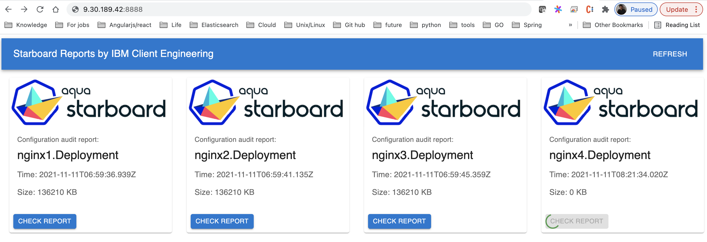

# starboard-report

This repo aim to enrich the functionality of [starboard](https://github.com/aquasecurity/starboard).

>Starboard integrates security tools into the Kubernetes environment, so that users can find and view the risks that relate to different resources in a Kubernetes-native way.


The starboard will watch a certain `namespace` for workload(basically the `pod`), if `pod` created or changed it will do scan(vulnerability scan by [Trivy](https://github.com/aquasecurity/trivy) and config audit by [Polaris](https://github.com/FairwindsOps/polarishttps://github.com/FairwindsOps/polaris)) on it.

----

## Background
The problem is the scan report display, see the picture upper, two way to check the report;
- With CLI command `starboard get report` to generate `html` file.
- Install software `LENS` or `Octant` outside the cluster then connect to the cluster to get a panoramic view of whole cluster

The former is not possible in a cluster which from cloud provider.
And the latter is not follow the insight of `devsecops`.

From the perspective of `devsecops`, we believe a application should be self-governing, means after update/installed(by `gitops` maybe), there should be a specific report for the application avaiabled for administrator, just for the application.

So, the repo will be part of `application`'s artifact, act as a security/compliance reporter after every upgrade.


## Quick Start

The quick start steps are being enhanced to more convenient.

1. Deploy the starbort report
   ```
   kubectl create -f ./release.yaml
   ```
   And then check if it works:
   ```
   # kubectl -n starboard-report-system get pod
     NAME                                  READY   STATUS    RESTARTS   AGE
     controller-manager-585bd5b76d-mpzzv   2/2     Running   0          13m
     starboard-operator-7f756cf4c5-nl8qp   1/1     Running   0          13m
   ```

2. Expose the service

  - For OpenShift cluster, you can use `Route` to expose the service:
     ```
     kubectl apply -f config/route/route.yaml
     ```
  
  - For Kubenertes cluster, you can forward the port to access the nginx(will craete `ingress` later)
     ```
     kubectl -n starboard-report-system port-forward service/report 8888:80 --address 0.0.0.0
     ```

6. Create a sample in the namespace: `starboard-report-system`
   ```
   kubectl create deployment nginx1 --image nginx:1.16 -n starboard-report-system
   ```

7. Check the report with the above port:

   


For now, the application will watch resource in namespace: `starboard-report-system`, if you want to change it, please update the configuration in [config](./config/default/configmap.yaml).
